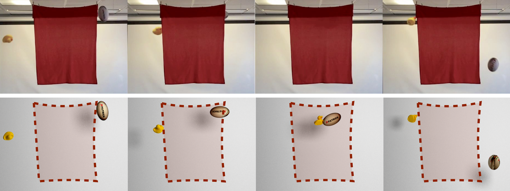

## Paper implemented: [ Physics-guided Reconstruction of Collisions from Videos](http://geometry.cs.ucl.ac.uk/projects/2016/smash/), <br />


Starting from an input video of a collision sequence behind a curtain (top), SMASH reconstructs an accurate physically valid collision (bottom) using laws of rigid body physics for regularization. Note the reconstructed spin (_i.e._, angular velocity) of the objects.


---

## This repository

| Core modules: | Contrib modules: |
|:-------------:|:----------------:|
| imgproc       | cudabgsegm       |
| highgui       | cudalegacy       |
| core          | [xfeatures2d](https://github.com/opencv/opencv_contrib/tree/master/modules/xfeatures2d) |
Note: see [opencv_contrib/README.md](https://github.com/opencv/opencv_contrib/blob/master/README.md) for installation.

##### [Google] Ceres <small>([link](http://ceres-solver.org))</small>
##### VTK <small>([link](http://vtk.org))</small>
* vtkCommonMath 
* vtkCommonCore 
* vtkRenderingOpenGL 
* vtkRenderingLOD 
* vtkInteractionStyle


### Platform
The code was developed and tested on *Ubuntu 16.04 LTS* with *gcc 6.2*.

---

### Installation
```bash
git clone git@github.com:amonszpart/SMASH.git
cd SMASH
mkdir build && cd build
cmake [-DOpenCV_DIR=<path/to/opencv/share/OpenCV>]..
make -j 8

```

---


### SMASH Blender plugin
* Open the user <b>File</b> -> <b>User Preferences</b>,
* select the <b>Add-ons</b> tab,
* press <b>Install from File</b> and 
* select *smash_blender_plugin/physacqPanel.py*.

If you want it to be enabled on restart, press <b>Save User Settings</b>.

---

### TODO
* Rest of the dataset
* Initialization code
